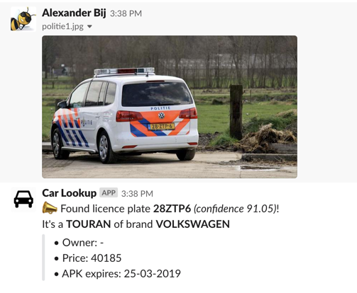

# Slack bot: Car Lookup

Slackbot to scan images for licence plates and report the known car details:

## Components:

- Open data: [RWD gekentekende voertuigen](https://opendata.rdw.nl/Voertuigen/Open-Data-RDW-Gekentekende_voertuigen/m9d7-ebf2)
- Github project: [Open Automated LicencePlate Recogniser](https://github.com/openalpr/openalpr)

## Testing locally

Only if Flask is running in debug mode:

- [http://localhost:5000/test?kenteken=28-ZTP-6](http://localhost:5000/test?kenteken=28-ZTP-6)
- [http://localhost:5000/test?file=someimage.jpg](http://localhost:5000/test?file=someimage.jpg)

#### TODO's:

- More secure incoming connection
    - Use `from slackeventsapi import SlackEventAdapter` see: https://github.com/slackapi/python-slack-events-api
    - Include LetsEncrypt for a valid TLS connection.
    - Validate events from Slack
- Use a single command `/kenteken` and not also `/my_car` and use an english name, I like: `/car` simple and short!
- Make the bot Workspace independend: Its now for a single Workspace (Xebia) using one fileshare with a single csv-file