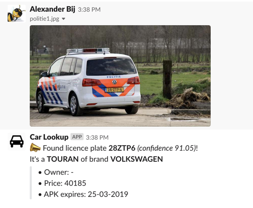

# Slack bot: Car Lookup

[](https://dev.azure.com/alexanderbij/alexanderbij/_build/latest?definitionId=1&branchName=master)

Slack bot for Dutch licence plate lookups via the `/car` slash command. Look up car details and find out who owns it — or register your own car. Runs on Azure Functions (free Consumption plan).

> **Note:** Image recognition (ALPR) is not included in this version.



## Usage

| Command | Description |
|---------|-------------|
| `/car AA-12-BB` | Look up car details and owner _(dashes optional)_ |
| `/car tag AA-12-BB` | Register yourself as the owner |
| `/car tag AA-12-BB @someone` | Register someone else as the owner |
| `/car tag AA-12-BB "Name"` | Register an owner by name |
| `/car untag AA-12-BB` | Remove ownership |

## Data sources

- **[RDW](https://opendata.rdw.nl/Voertuigen/Open-Data-RDW-Gekentekende_voertuigen/m9d7-ebf2)** — brand, model, catalogue price, APK expiry
- **[Finnik](https://finnik.nl)** — acceleration (0–100 km/h)
- **Owners CSV** — stored in Azure Blob Storage

## Hosting

Runs as an Azure Functions app (Linux Consumption plan, Python 3.12).

### Environment variables

| Variable | Required | Description |
|----------|----------|-------------|
| `SLACK_SIGNING_SECRET` | Yes | Slack app signing secret |
| `AZURE_STORAGE_CONNECTION_STRING` | Prod | Blob Storage for owners CSV |
| `AZURE_STORAGE_CONTAINER` | No | Container name (default: `slackbot`) |
| `AZURE_STORAGE_BLOB_NAME` | No | Blob file name (default: `car-owners.csv`) |
| `RWD_APPTOKEN` | No | Socrata app token for higher RDW rate limits |

### Local development

```bash
cp local.settings.json.example local.settings.json
# fill in your secrets

pip install -r requirements.txt
pip install pytest pytest-asyncio pytest-cov ruff

func start  # requires Azure Functions Core Tools v4
```

Expose to Slack with `ngrok http 7071`, then set the slash command URL to `https://<ngrok-id>.ngrok.io/api/slack/commands`.

### Deploy to Azure

```bash
func azure functionapp publish <function-app-name> --build remote
```

### Run tests

```bash
pytest tests/ -v
```
